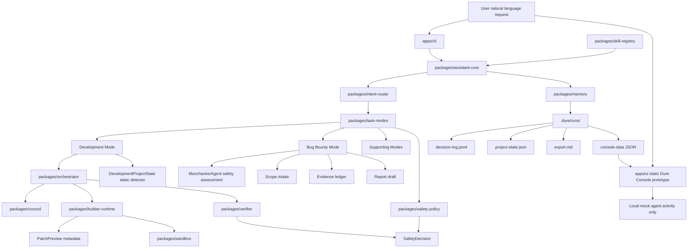
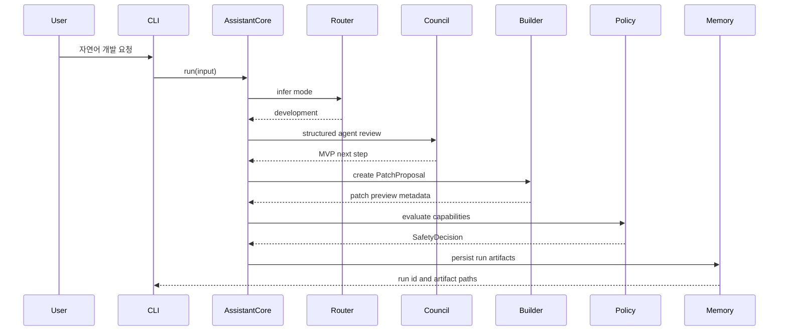
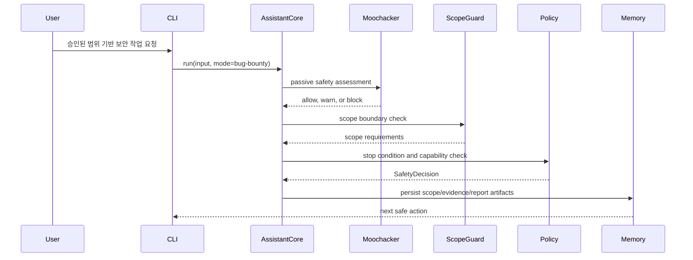

# Architecture Diagram

이 문서는 Dure v0.1의 패키지 경계와 안전 흐름을 한눈에 보기 위한 다이어그램입니다. Dure는 사용자의 자연어 요청을 바로 코드 변경으로 연결하지 않고, mode routing, agent review, safety policy, verification, memory persistence를 거쳐 작은 다음 단계로 축소합니다.

## 주요 경계

- `apps/cli`는 v0.1의 기본 사용자 인터페이스입니다.
- `apps/ui`는 read-only static Dure Console prototype입니다.
- `apps/ui`는 사용자가 선택한 `console-data` JSON을 import할 수 있지만 execute, persist, scan, approve, apply, verify, backend call을 하지 않습니다.
- `packages/core`는 공유 타입과 계약을 소유합니다.
- `packages/assistant-core`는 routing, mode execution, safety decision persistence, run record 생성을 조율합니다.
- `packages/task-modes`는 deterministic proposal을 생성합니다.
- Development project state detection은 정적/로컬 분석입니다. metadata는 읽지만 script를 실행하지 않습니다.
- Patch preview metadata는 approval 전 read-only 제안입니다. risk, file-level change plan, unified diff를 요약합니다.
- `packages/safety-policy`는 capability가 allowed, warning, blocked 중 어디에 해당하는지 판단합니다.
- `packages/memory`는 run artifact와 redacted Markdown export를 저장합니다.
- `packages/verifier`는 proposal-time verification과 approved-workspace verification을 담당합니다.

## Development Mode 흐름

## Bug Bounty Mode 흐름

## 금지된 경로

다음 경로는 v0.1에서 의도적으로 막혀 있습니다.

- 자연어 요청에서 즉시 파일 수정
- review agent의 patch 작성
- approval 없는 apply
- allowlist 밖의 script 실행
- arbitrary shell execution
- 자동 package install
- live bug bounty target scanning
- exploit, brute force, DoS, rate-limit bypass
- untrusted skill 자동 실행
- UI prototype의 backend mutation

새 패키지나 기능은 이 경계를 약화시키지 않아야 합니다. 외부 통합이나 실제 실행 capability는 explicit approval layer, audit log, rollback/stop condition이 먼저 설계된 뒤 추가합니다.
