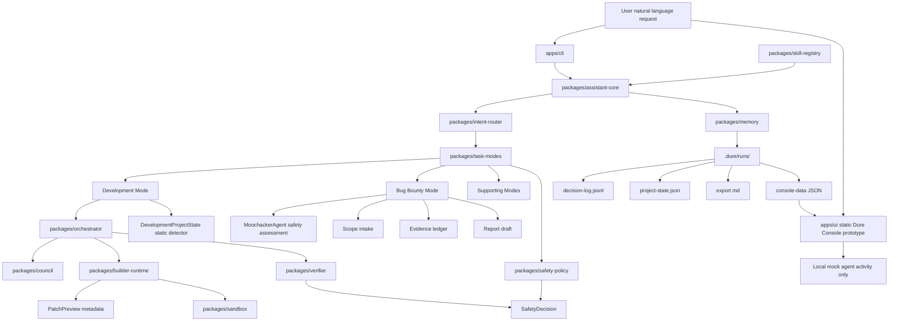

# Architecture Diagram

## Boundaries

- `apps/cli` is the only user-facing app in v0.1.
- `apps/ui` is a read-only static prototype; it can import user-selected console-data JSON and does not execute, persist, scan, approve, apply, verify, or call a backend.
- `packages/core` owns shared types.
- `packages/assistant-core` coordinates routing, mode execution, safety decision persistence, and run records.
- `packages/task-modes` produces deterministic proposals.
- Development project state detection is static and local; it reads metadata but does not execute scripts.
- Patch preview metadata is proposal-generated and read-only; it summarizes risk, file-level change plans, and unified diff text before approval.
- `packages/safety-policy` decides whether capabilities are allowed, warning-only, or blocked.
- `packages/memory` persists run artifacts and redacted Markdown exports.
- `packages/verifier` performs proposal-time and approved-workspace verification.

No package may add uncontrolled shell execution, live bug bounty testing, or external integrations without an explicit approval layer.
